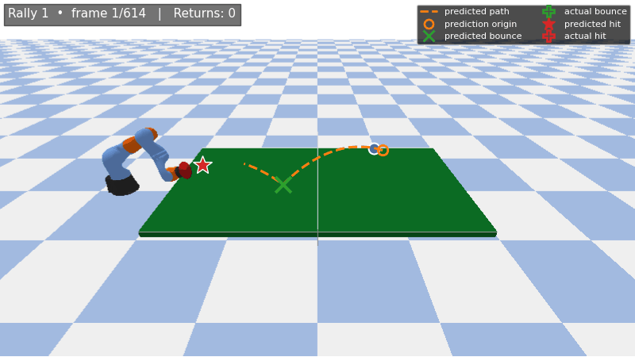
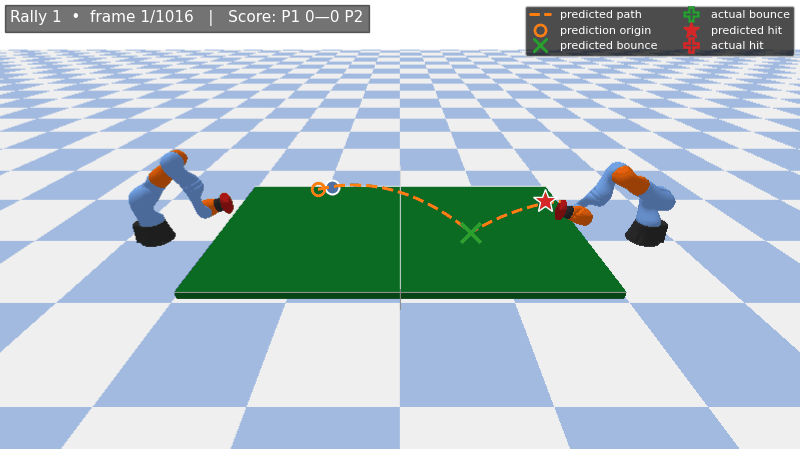

# Robotic Table Tennis &mdash; ECE 275 Term Project

A model-based controller for a 7-DOF KUKA LBR iiwa 7 manipulator playing table
tennis in PyBullet. Wins the single-player serve-return benchmark (5/5 games,
~74 % return rate) and plays competitive two-robot matches.

<p align="center">
  
</p>

> **Single-player benchmark, full game (won 11–6).** Orange dashed = planner's
> projectile prediction; green &times; / red &#9733; = predicted bounce and
> strike; green / red &#10010; = actually observed bounce and paddle contact.

The full algorithm description, parameter-tuning methodology, mirror-IK ablation,
and the connection to ECE 275 course concepts are in the term-project report
([`ECE275_Nussair_Hroub_TermProject/report.pdf`](ECE275_Nussair_Hroub_TermProject/report.pdf)).

---

## Repository layout

```
table_tennis_final/
├── README.md                                    (this file)
├── ECE275_Nussair_Hroub_TermProject/            term-project report
│   ├── report.tex                                LaTeX source
│   ├── report.pdf                                built report (16 pages)
│   ├── sections/                                 .tex per section
│   ├── configuration/                            packages, variables, commands
│   ├── assets/                                   figures used in the report
│   ├── references.bib
│   └── titlepage.tex
└── pybullet_table_tennis_environment_v2/        the solution (code)
    ├── one_player_game.py                        single-player entry + RobotPlayer
    ├── two_player_game.py                        two-player entry + RobotPlayer
    ├── visualize_full_game.py                    GIF renderer
    ├── param_search.py / param_search_runner.py  parallel sweep
    ├── train_rl.py / eval_rl.py / rl_env.py      residual PPO pipeline (optional)
    ├── table_tennis_env.py                       physics env (provided, unmodified)
    ├── simulation_manager.py                     game rules (provided, unmodified)
    ├── player.py / utils.py                      provided helpers (unmodified)
    ├── tuning_legacy_env.json                    legacy-env reference tuning
    ├── param_search_results.json                 5184-config sweep results
    ├── assets/
    │   ├── single_game.gif                       demo: full single-player game
    │   ├── double_game.gif                       demo: full two-robot match
    │   └── simple_env.png
    └── runs/final_rl_2/                          residual PPO checkpoint (optional)
        ├── model.zip                              final policy
        ├── best/best_model.zip                    best-eval checkpoint
        ├── vecnormalize.pkl                       observation normaliser
        └── eval/evaluations.npz                   eval-time return curve
```

Per the project brief, the only files containing newly-written submission code
are `one_player_game.py` and `two_player_game.py`. Everything else is either
development tooling or provided-by-course material.

---

## Quick start

### 1. Install

```bash
git clone git@github.com:NussairHroub/table_tennis_final.git
cd table_tennis_final

conda create -n table_tennis python=3.10 -y
conda activate table_tennis
conda install -c conda-forge pyqt -y
pip install -r pybullet_table_tennis_environment_v2/requirements.txt
cd pybullet_table_tennis_environment_v2
```

> SSH users need X11 forwarding (`ssh -X`) for the matplotlib viewer and the
> PyBullet GUI. Headless runs need no extra setup.

### 2. Single-player benchmark (one robot returning serves)

```bash
# Headless — runs as fast as possible, prints score per episode
python one_player_game.py --player robot --episodes 5

# Headless smoke test (one game)
python one_player_game.py --player robot --episodes 1

# With the PyBullet GUI (real-time, opens a window)
python one_player_game.py --player robot --gui --episodes 1

# Baseline controllers for comparison
python one_player_game.py --player simple --episodes 5
python one_player_game.py --player idle   --episodes 3
python one_player_game.py --player simple --gui --episodes 1
```

### 3. Two-player match (two robots, full game to 11 with 2-point lead)

```bash
# Headless, robot vs robot
python two_player_game.py --player1 robot  --player2 robot  --episodes 3

# Headless, robot vs simple baseline (both directions)
python two_player_game.py --player1 robot  --player2 simple --episodes 3
python two_player_game.py --player1 simple --player2 robot  --episodes 3

# With the PyBullet GUI, robot vs robot, single match
python two_player_game.py --player1 robot --player2 robot --gui --episodes 1

# With the PyBullet GUI, robot vs simple
python two_player_game.py --player1 robot --player2 simple --gui --episodes 1
python two_player_game.py --player1 simple --player2 robot --gui --episodes 1

# Sanity-check: a do-nothing opponent
python two_player_game.py --player1 robot --player2 idle --episodes 1
python two_player_game.py --player1 idle  --player2 robot --episodes 1
```

Available controllers: `robot` (this submission), `simple` (provided
`SimpleTrackingPlayer`), `idle` (provided `DoNothingPlayer`).

### 4. Residual PPO policy on top of the classical expert (optional)

```bash
# Evaluate the best-eval checkpoint (headless)
python eval_rl.py --model runs/final_rl_2/best/best_model.zip --episodes 5

# Evaluate the final checkpoint
python eval_rl.py --model runs/final_rl_2/model.zip --episodes 5

# Watch the trained policy in the PyBullet GUI
python eval_rl.py --model runs/final_rl_2/best/best_model.zip --gui --episodes 1
```

---

## Demo

### Single-player serve-return (won 11–6)

<p align="center">
  
</p>

### Two-robot match (Player 1 wins 11–7)

<p align="center">
  
</p>

| Marker | Meaning |
| --- | --- |
| <kbd>&minus; &minus; &minus;</kbd> orange dashed | Planner's locked projectile prediction |
| &#9711; orange | Prediction origin |
| &times; green | Predicted bounce |
| &#10010; green | Actual bounce |
| &#9733; red | Predicted strike |
| &#10010; red | Actual paddle contact |
| Blue trail | True ball trajectory |

---

## Headline numbers

| Setting | Result |
| --- | --- |
| Single-player benchmark, 5 episodes | **5/5 wins, 55/74 returns (74.3 %)** |
| `robot` vs `simple` baseline | **6/6 games to the controller** |
| `robot` vs `robot` self-play | Roughly even |
| Mirror-IK ablation, Player 1 paddle-contact rate | **11.8 % &rarr; 86.3 %** |
| Parameter sweep size | 5,184 configurations × 5 seeds (~16 min, 16 workers) |

A full breakdown is in
[`ECE275_Nussair_Hroub_TermProject/report.pdf`](ECE275_Nussair_Hroub_TermProject/report.pdf).

---

## Reproducing the GIFs

```bash
cd pybullet_table_tennis_environment_v2
python visualize_full_game.py --mode single --output assets/single_game.gif
python visualize_full_game.py --mode double --output assets/double_game.gif
```

Tunable: `--seed`, `--stride` (capture every Nth sim step), `--fps`, `--width`,
`--height`. Playback speed = `(240 / stride) / fps`.

---

## Acknowledgements

Built for **ECE 275 — Robot Planning and Control** (KAUST, Spring 2026,
Prof. Shinkyu Park). The PyBullet simulator and the
`Player` / `SimulationManager` skeleton in
`pybullet_table_tennis_environment_v2/` were provided by the course staff
(TAs: David Alvear, Sushil Samuel Dinesh).

Author: **Nussair Hroub** &mdash; <nussair.hroub@kaust.edu.sa>
